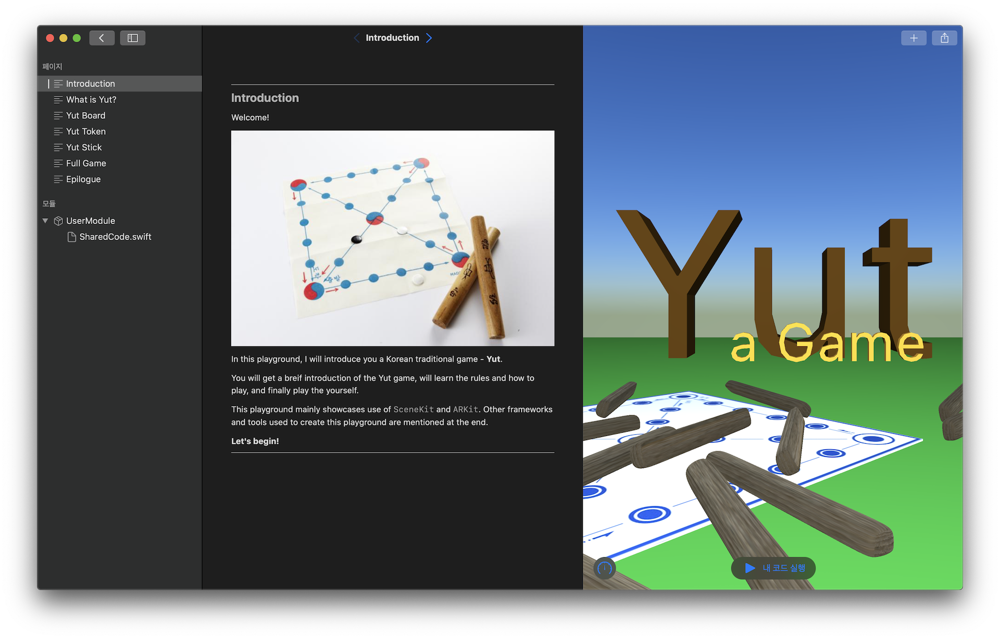
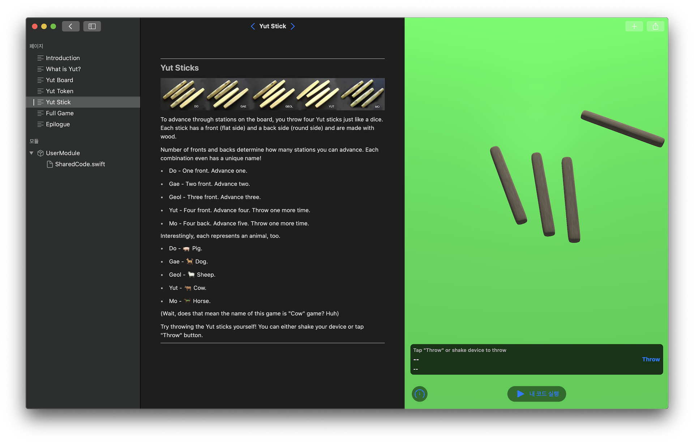

# WWDC20 PlaygroundBook Sumission

## Description

This PlaygroundBook is accepted as Apple's WWDC20 Student Swift Challenge award. In this PlaygroundBook, a Korean traditional game "Yut (윷)" is introduced. You can get a breif look at what Yut is, how the game works, and get to play it in a 3D environment. It can run on both macOS & iPadOS Swift Playground, but was submitted to run on iPadOS. (Because `PencilKit` does not work on macOS)

It is made and tested with following tools: Xcode 11, Swift Playground (macOS & iPadOS version), Swift Playgrounds Author Template from Apple, Affinity Photo, Blender, and Reality Converter from Apple.

It uses following frameworks: `Foundation`, `UIKit`, `SceneKit`, `AVFoundation`, `PencilKit`.

Resources are from: Wikipedia, Wikimedia, textures.com.

## Notice

Just 20 minitue before submission, unknown part of the PlaygroundBook suddenly kept crashing, rendering everything unsuable. (Yes, I should have used git  ¯\_(ツ)_/¯) I had to sumit a backup version that was unpolisehd and buggy. It missed some features (especially `ARKit` version of the game and the way game work), had typos, unmatching descriptions and dummy images, with some bugs.

I was originally extremely disappointed that I couldn't submit a fully polished and feature-complete version originally imagined. Now I'm very surprised and happy I got accepted. 

This version of PlaygroundBook keeps everything as submitted, for anybody who wants future reference.

## LICENSE

See `LICENSE`.